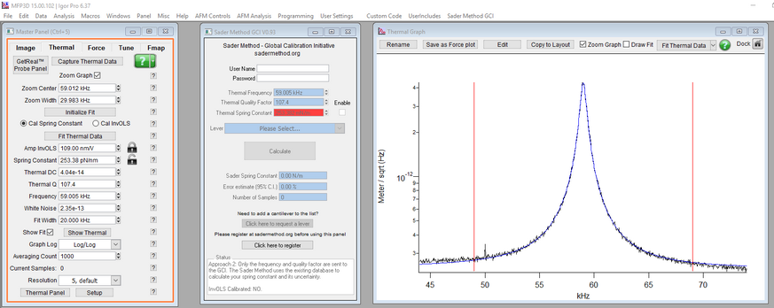
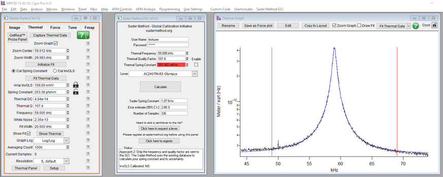

# Asylum Research Version 0.93 - Sader Method API Version 1.1

We have developed an API interface that lets you seamlessly use the Global Calibration Initiative directly on your AFM. This development is free to all AFM users.

This software is compatible with Asylum Research systems and with this API interface, you can effortlessly upload data to the GCI and
access its worldwide database - while using the standard Thermal Tune of the Asylum AFM.

##Installation:

1. Close Igor Pro
2. Download EasyHTTP at:
 * https://www.wavemetrics.com/sites/www.wavemetrics.com/files/documents-imported/easyHttp-IGOR.5.00.x-1.x-dev.zip
3. Extract and install easyHTTP (instructions and installer in zip file)
4. Copy [GCI_Panel.ipf](GCI_Panel.ipf) to:
 * Igor Pro\AsylumResearch\Code3D\UserIncludes  (Create the UserIncludes folder if it is missing on your system)
5. Start Asylum Research Software
6. ‘Sader Method GCI’ will now be a menu item - click and select ‘GCI Panel’ to open.
7. Input your username and password (as registered on sadermethod.org) directly on the GCI Panel (in your AFM Software), and press Enter.

Please email feedback (quoting version number):  support@sadermethod.org

We hope that this new development helps to facilitate the worldwide standardisation of AFM force measurements.

# Using the API Interface for Asylum Research

Enter your username and password for the Sader Method GCI (sadermethod.org), and press Enter, to enable the GCI Panel.

Thermal frequency, quality factor and spring constant in the GCI Panel are taken directly from the Thermal Panel in the Asylum Research AFM Software.

**Retract your cantilever at least 100 μm from the surface prior to taking a Thermal.**

##Approach 1:
* First calibrate the spring constant using the Thermal Method.
* Tick the Enable checkbox next to Thermal Spring Constant.
* Select your Lever from the pull down menu and press ‘Upload & Calculate’.
* The frequency, quality factor and spring constant are merged with the GCI database. The Sader Method gives a new calculation of your spring constant and its uncertainty.

##Approach 2:
* Measure and fit a Thermal only (InvOLS not required).
* Ensure the Enable checkbox next to Thermal Spring Constant is NOT ticked.
* Select your Lever from the pull down menu and press ‘Calculate’.
* Only the frequency and quality factor are sent to the GCI. The Sader Method uses the existing database to calculate your spring constant and its uncertainty.

_Approach 1 lets users contribute their data to the international database, and compares their calibration measurements to those of others - letting users help each other and providing a global reference point for AFM force measurements._

**The Thermal spring constant is your locally calibrated value, whereas the Sader spring constant is standardised internationally. Check your measurements if there is a large difference between these values; see Reference (below).**

* **Request a lever**: Users request cantilever models to be added to the GCI via this link.
* **Register**: Users register via this link.
* **Status**: Indicates if InvOLS is calibrated and whether Approach 1 or 2 is used.

**NOTE: Take measurements of the fundamental flexural mode in air. The GCI reports the static normal spring constant at the imaging tip position.**

Reference: [Sader et al., Review of Scientific Instruments, 87, 093711 (2016).](http://scitation.aip.org/content/aip/journal/rsi/87/9/10.1063/1.4962866)
